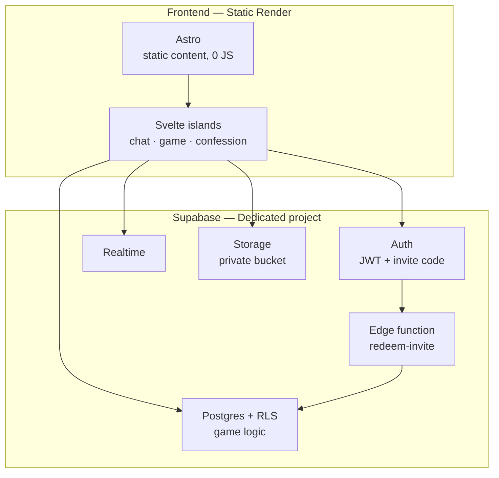
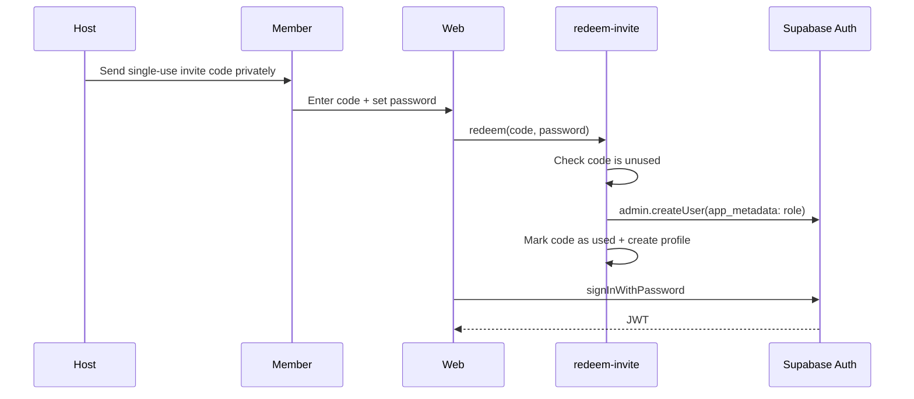
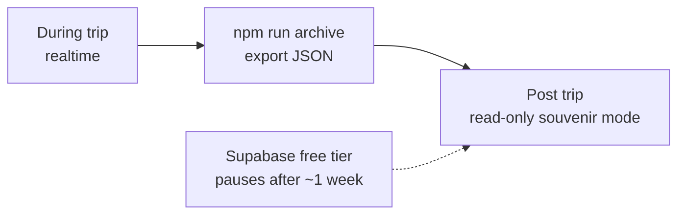

# dalat-2026 — Architecture

Da Lat trip website: static content (itinerary, eateries, locations) + interactive features during the trip (chat, confessions, thoughts, game). ~10 group members.

## Stack



- **Static render** — Free, no cold start, deploy directly from repo.
- **Astro + Svelte islands** — Static sections ship 0 JS; JS is only fetched for chat/game.
- **Dedicated Supabase for this trip** — Clean schema, isolated migrations without affecting other trips.
- **Migrations** — Supabase CLI, numbered `001_`, `002_`.

## Auth — Why use Supabase Auth

- Custom session management ⇒ every request runs under `anon` role, **lacking identity**.
- That leaves two choices: enable write access for `anon` (easily bypassed), or wrap every write in RPC (bloating into thousands of SQL lines).
- Having `auth.uid()` simplifies RLS policies into **one single concise rule**:

```sql
create policy "only edit own messages" on messages
  for update to authenticated using (auth.uid() = author_id);
```

- Free built-in benefits: rate limiting, session revocation, refresh tokens, password change invalidates old sessions.

## Invite Code Flow



- No shared email ⇒ account uses dummy internal email `<slug>@dalat.local`, no emails ever sent.
- Subsequent visits: just log in, accessible from other devices.
- Store `role` in **`app_metadata`**, NOT `user_metadata` — `user_metadata` can be mutated by users via `auth.updateUser()`.

## Mandatory Rules

- Never `grant insert/update/delete` to `anon` on any table.
- Default RLS to `authenticated`, matching `auth.uid()`.
- Use `security definer` RPC only when multi-step atomic transactions are needed (team splitting, finalizing votes).
- Game secrets (imposter, secret song) are computed server-side per viewer — do NOT send everything to client and hide via CSS.
- Private image bucket with signed URLs.
- Passwords must be at least 8 characters.

## Archiving — Build from day one, do not leave until the end



- Project will pause post-trip ⇒ must have an exit path to pure static.
- `npm run archive` exports chat, confessions, thoughts, game results to `src/data/archive.json`.
- Site auto-detects: archive present → render read-only; absent → run realtime.
- `dalat-2026/` directory is self-contained and lives on even if Supabase project is deleted.
- Writing export logic after backend is already paused is extremely painful.

## Directory Structure

```
dalat-2026/
├── frontend/           # Astro 5 web app (Static render + Svelte Islands)
│   ├── src/
│   │   ├── data/       # lich-trinh.ts — trip content, edit here
│   │   ├── components/ # .astro — static parts
│   │   ├── layouts/
│   │   ├── pages/
│   │   ├── styles/     # tokens.css + global.css
│   │   ├── islands/    # .svelte — chat, game, confession
│   │   └── lib/        # Supabase client + RPC wrappers
│   └── figures/        # Polaroid & sticker assets
├── backend/            # Supabase database & scripts
│   ├── supabase/
│   │   ├── migrations/ # 001_, 002_
│   │   └── functions/  # Edge functions (e.g. redeem-invite)
│   └── scripts/
│       └── archive.js  # JSON export script for closing trip
└── package.json        # Root package.json script orchestrator
```

Two intentional deviations from original plan:

- **`src/data/*.ts` instead of Content Collections.** The itinerary is a single typed data file edited by one person — collections are only worth it with multiple markdown files. Easy to migrate later.
- **Svelte not installed yet.** Current page has no interactive elements beyond a small scroll script. Add Svelte when starting work on chat/game, not now.

- Reusing for next trip: **only `lib/`** — a few hundred lines of JS, UI-agnostic.
- Do NOT share CSS or components.
